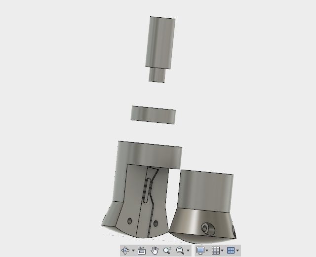

# CNC Drag knife/roller

Most of us use our cnc millin machines to mill wood, plastics and even metal, but sometimes we would like to cut very thin materials like vinyl, cardboard, foam board etc which cannot be milled. This is where a Drag knife comes in handy.

A Drag knife is a tool that attaches to the spindle of your mill and traces the path it is moving. The unique thing of a drag knife is that it is able to self-orient itself to be tangential to the cutting like. This is because the blade is kept at a slight angle, creating an offset from the center of the spindle. This angle is known as caster angle.

This principle is used in anyhting from automobiles to office chairs to provide directional stability. In our case the blade is kept at a slight negative caster angle, so that it is dragging behind the center of the shaft. Due to this offset, when ever the spindle changes direction, a slight torque is exerted on the blade, which will keep it pointed at tangent to the the direction of travel.

There are many proffessional drag knifes available, most common of which would be the donke cnc drag knife. But these are unjustifiably expensive to buy. A need for a DIY solution was felt.

## Version 1.0

This is the first design. The body is 3 pieces, which is design to be joined together by screws to provide easy access to change the blades. It is designed to carry a number 11 surgical scalpel balde. A bearing is provided to help the blade swievel and it fit into a 1/2inch collet. I went with a very large blade offset of 10mm. My spindle was large and it has a lot of momentum while turning.

unfortunately, I did not test the design, as after assembling it I realized one problem. The bearing had too much play and the knife would swing back and forth about 5mm about the Z-axis. This design is a no go.

## Version 2.0

.jpg)

.jpg)

A simpler design without a bearing on it. The knife is two parts, the main body and the knife holder, which come together with screws.
THis design alows simpler fabrication and testing and avoids unessasry components. The only question being, does the blade have enough torque to turn the spindle? It turns out it does. 

.jpg)

This knife cuts beauitifully. Its able to take sharp cuts and turns tangent to the cutline.

.jpg)

## Drag Roller

A device similar to a drag knife, but instead of cutting the roller depresses the material forming a crease line. This line can be used to bend the material. For examlple when making a carboard box, the roller can be used to depress the edges that need to be folded and then using the knife cut out the outer edges.
